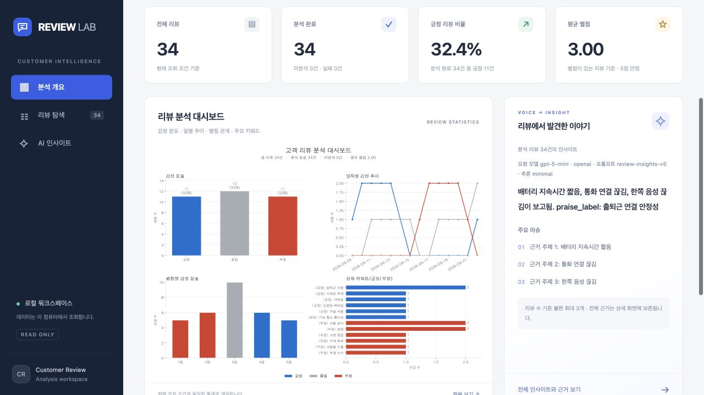
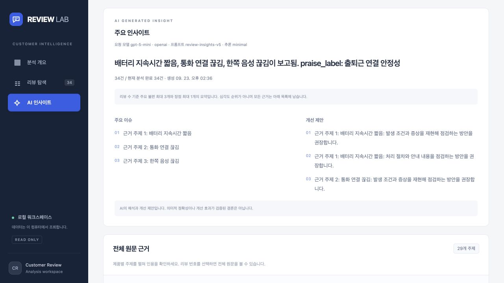
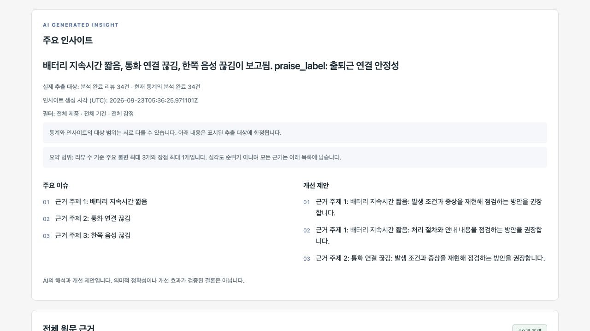
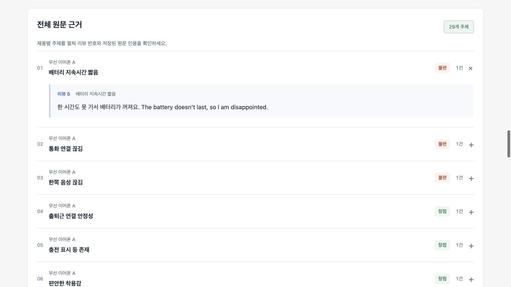
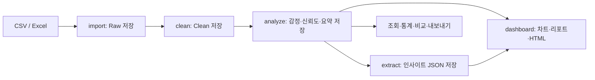

# [Project C] AI 기반 고객 리뷰 감정 분석 대시보드

**AI Native Advanced · 파일 수집부터 감정 분석, 근거 기반 인사이트, 시각화 리포트까지 연결하는 Python CLI 프로젝트**

CSV/Excel의 고객 리뷰를 SQLite에 원본·정제 데이터로 나누어 저장하고, AI로 감정·신뢰도·요약·키워드를 분석합니다. 저장된 결과를 조회·비교하고 PNG, TXT/Markdown, 단일 HTML 및 CSV/JSONL/Excel로 출력할 수 있습니다.

> **제출 자료:** [샘플 CSV 40행](data/sample_reviews.csv) · [최종 테스트 플로우](docs/FINAL_TEST_FLOW.md) · [기존 README 보관본](docs/README_LEGACY.md)

## 실행 화면

[샘플 CSV](data/sample_reviews.csv) 40행 중 정제·분석을 마친 **34건**으로 실행한 실제 화면입니다(2026-09-23). AI 문구와 감정 분류는 해당 실행의 저장 결과입니다.

### 웹 대시보드

저장된 리뷰의 핵심 지표, 감정 분포·추이·별점별 차트와 인사이트를 함께 확인합니다.



<details>
<summary>웹 AI 인사이트 화면 보기</summary>

요약, 주요 이슈·개선 제안과 전체 원문 근거를 별도 화면에서 탐색합니다.



</details>

### 단일 HTML 대시보드

`dashboard --html`로 만든 파일의 인사이트 영역입니다. 차트·통계와 함께 요약·이슈·개선 제안을 파일 안에 담아 서버 없이 열람할 수 있습니다.



<details>
<summary>단일 HTML의 원문 근거 펼치기</summary>

제품별 근거 주제 29개를 보존하며, 주제를 펼치면 리뷰 번호와 저장된 원문 인용을 확인할 수 있습니다.



</details>

## 1. 프로젝트 목표와 처리 흐름

많은 리뷰에서 반복되는 불편과 칭찬을 찾고, 제품 개선에 참고할 수 있는 근거를 함께 제공합니다. 주요 결과물은 **CLI 애플리케이션과 정적 차트·파일 리포트**이며, 저장된 결과를 탐색하는 로컬 웹 화면도 제공합니다.



`analyze`와 `extract`가 AI를 호출합니다. 조회·집계·내보내기·대시보드 생성은 저장된 결과를 사용합니다. 입력은 파일 기반이며, 쇼핑몰 크롤링은 제공하지 않습니다.

## 2. 과제 요구사항과 구현 내용

### 필수 기능

| 요구사항 | 구현 내용 | 확인할 명령·문서 |
|---|---|---|
| 서브커맨드 CLI | `argparse` 기반 필수 9개 명령과 추가 `compare` 명령 | `python main.py --help` |
| 리뷰 수집·원본 저장 | CSV, XLSX, XLS 읽기, SQLite Raw 저장, 중복 `skip`/`upsert` | [`import`](docs/IMPORT.md) |
| 데이터 정제 | 본문 필수 검증, 공백 정규화, 최소 길이·날짜·별점 검증, Clean 분리 저장 | [`clean`](docs/CLEAN.md) |
| AI 감정 분석 | 긍정·중립·부정, 0~1 신뢰도, 요약·키워드 저장, 대상 선택·실패 기록·재시도 | [`analyze`](docs/AI_CLI.md) |
| AI 키워드·요약 추출 | 제품·기간·감정별 키워드, 이슈·개선 제안·요약, 원문 인용과 JSON 저장 | [`extract`](docs/INSIGHT_EXTRACTION.md) |
| 데이터 조회·검색 | 감정·별점·기간·제품 필터, 페이지네이션·정렬, 원문과 분석 상세, 통계 | [`list`, `show`, `stats`](docs/QUERY_CLI.md) |
| 차트 시각화 | 감정 분포·날짜별 추이·별점별 감정 분포와 키워드를 통합 PNG로 저장, 한글 폰트 탐색 | [`dashboard`](docs/DASHBOARD.md) |
| 종합 리포트 | 완료율·실패율·평균 별점 등 지표, TOP 10 키워드, AI 추출 결과, 콘솔·TXT/MD 출력 | [리포트 생성](docs/REPORT_GENERATION.md) |
| 데이터 내보내기 | CSV·JSONL·Excel 3개 포맷, 감정·최소 별점 등 필터 | [`export`](docs/EXPORT.md) |
| 설정·로깅 | `config.json`, 환경변수·`.env`, INFO/WARNING/ERROR 로그와 파일 회전 | [설정 예시](config/config_example.json), [환경변수 예시](.env.example) |
| 영구 저장·모듈화 | SQLite Raw/Clean/Analysis 분리, CLI·서비스·저장소·AI·출력 모듈 분리 | [저장소](docs/SQLITE_STORAGE.md), [모듈 계약](docs/INTERFACE_BOUNDARY_SPEC.md) |
| 샘플 30건 이상 | 합성 CSV 40행: 일반·다국어·선택 항목 누락·중복·잘못된 값 포함 | [샘플과 예상 결과](docs/FINAL_TEST_FLOW.md) |

제품명·작성일·별점은 **선택 항목**입니다. 누락값을 `NULL`로 보존하며, 값이 입력된 날짜와 별점은 유효성을 검사합니다. 평균 별점은 별점이 있는 정제 리뷰, 감정 비율은 분석 완료 리뷰를 기준으로 계산합니다.

### 보너스 및 추가 기능

| 기능 | 구현 내용 |
|---|---|
| 다국어 분석 | 한국어·영어·한영 혼합 원문 분석, 한국어 요약·키워드, 언어별 평가 지표 |
| 감정 변화 알림 | 최근 N일과 직전 N일의 부정 비율 비교. 기본 7일·20%p 상승·기간별 최소 분석 5건 |
| 단일 HTML | 차트·통계·알림 내장, 인사이트 요약 카드와 제품별 근거 접기·펼치기. 파일 하나로 열람 |
| 제품·카테고리 비교 | `compare`로 건수·평균 별점·감정 비율 비교, CSV·JSON·PNG 저장 |
| 로컬 웹 화면 | 분석 개요·리뷰 탐색·AI 인사이트, 필터·원문 상세·리포트 다운로드, 선택적 인사이트 생성 |
| 인사이트 결과 검증 | 원문 인용 검증, 선택 대상·조건·생성 설정에 따른 저장 결과 재사용 및 무효화 |

## 3. 실행 환경과 기술 스택

| 구분 | 사용 기술 |
|---|---|
| Python | **3.11 이상**, 검증 환경 3.12.14 |
| CLI·공통 처리 | `argparse`, `logging`, `dataclasses` |
| 영구 저장소 | SQLite3 |
| 파일 입출력 | pandas, openpyxl, xlrd |
| 시각화 | Matplotlib |
| AI | OpenAI 공식 Python SDK, 기본 모델 `gpt-5-mini`, OpenAI 호환 서버 어댑터 |
| 웹 화면 | HTML·CSS·JavaScript, Python 로컬 HTTP 서버 |
| 테스트 | Python `unittest`, Node.js 내장 테스트 러너 |

과제의 Python 3.10 이상 조건을 충족하며, **현재 고정한 pandas·Matplotlib 버전의 설치에는 Python 3.11 이상이 필요**합니다. 패키지 버전은 [requirements.txt](requirements.txt)를 따릅니다. Node.js는 웹 코드 테스트에만 필요하며 웹 화면 실행에는 빌드나 npm 설치가 필요 없습니다.

## 4. 설치 및 설정

### 설치

아래 명령은 macOS/Linux의 새 작업 폴더 기준입니다. 팀 통합 브랜치는 `dev`입니다.

```bash
git clone --branch dev https://github.com/yhy0009/customer-review-analysis.git
cd customer-review-analysis

python3.12 -m venv .venv
source .venv/bin/activate
python -m pip install -r requirements.txt

cp .env.example .env
cp config/config_example.json config/config.json
python main.py --help
```

Windows PowerShell에서는 `py -3.12 -m venv .venv`, `.\.venv\Scripts\Activate.ps1`로 환경을 준비하고, `Copy-Item`으로 예시 설정을 복사합니다. 이미 설정한 작업 폴더에서는 기존 `.env`와 `config.json`을 유지합니다.

### AI 설정

실제 분석·추출을 실행하려면 `.env`의 `AI_API_KEY`에 발급받은 키를 넣습니다.

```dotenv
AI_API_KEY=발급받은_API_키
AI_PROVIDER=openai
AI_MODEL=gpt-5-mini
AI_REASONING_EFFORT=minimal
```

OpenAI 호환 서버는 `AI_PROVIDER=openai-compatible`과 `AI_BASE_URL`을 함께 설정합니다. 제공자별 실행 방법은 [AI 분석 안내](docs/AI_ANALYSIS.md)를 참고하세요. 키는 `.env`에서 관리하며, 공유하는 설정·소스·리포트에는 넣지 않습니다.

- 기본 DB: `data/app_database.db`, 기본 출력: `output/`, 기본 로그: `logs/app.log`.
- 환경변수로 JSON 설정을 덮어쓸 수 있습니다. 예: `CRA_DATABASE_PATH`, `CRA_OUTPUT_DIR`, `CRA_LOG_FILE`.
- 상대 파일 경로는 프로젝트 루트 기준입니다. `--config` 같은 전역 옵션은 명령 앞에 지정합니다.

## 5. 샘플로 재현하기

### 5-1. API 키 없이 화면 살펴보기

의존성을 설치한 뒤 다음 명령으로 저장된 합성 리뷰 **18건**의 데모를 실행할 수 있습니다.

```bash
python scripts/serve_dashboard.py --demo
```

브라우저에서 [로컬 대시보드](http://127.0.0.1:8765)를 열고, 종료할 때는 `Ctrl+C`를 누릅니다. 이 데모는 아래 CSV 40행 테스트와 별도의 저장된 평가 데이터이며 AI를 호출하지 않습니다.

### 5-2. 새 DB에 CSV 적재·정제

가상환경을 활성화한 프로젝트 루트에서, 아래 macOS/Linux 명령을 **같은 터미널에서 한 줄씩** 실행합니다. 단계별 확인 항목은 [최종 테스트 플로우](docs/FINAL_TEST_FLOW.md)를 참고하세요.

```bash
export CRA_TEST_RUN="submission-$(date +%Y%m%d-%H%M%S)"
export CRA_DATABASE_PATH="data/final-tests/$CRA_TEST_RUN.db"
export CRA_OUTPUT_DIR="output/final-tests/$CRA_TEST_RUN"
export CRA_LOG_FILE="$CRA_OUTPUT_DIR/app.log"

python main.py import --file data/sample_reviews.csv --policy skip
python main.py clean --policy skip --min-length 3
python main.py stats
python main.py list --sort id --order asc --size 50
python main.py show --id 34
```

| 단계 | 새 DB에서의 예상 결과 |
|---|---|
| CSV 입력 | 40행: 일반 30, 선택 항목 누락 4, 잘못된 값 4, 중복 2 |
| `import` | 처리 40, 저장 38, 중복 건너뛰기 2 |
| `clean` | 처리 38, 정제 성공 34, 의도한 오류 제외 4 |
| `stats` | 정제 34건, 분석 0건, 평균 별점 3.00 |
| `show --id 34` | 제품명·작성일·별점 없이 본문이 보존된 리뷰 |

샘플의 잘못된 별점·날짜·빈 본문·한 글자 본문 때문에 `clean`은 **종료 코드 1**을 반환합니다. 위 4건만 제외되면 예상 동작이므로 다음 명령을 진행합니다. `&&`로 연결하면 이 단계에서 멈춥니다. `show --id`는 CSV의 `S034`가 아닌 DB 내부 숫자 ID를 받습니다.

### 5-3. AI 분석·추출과 리포트 생성

다음 `analyze`·`extract` 명령은 실제 AI API 사용량을 발생시킵니다. 첫 리뷰의 분석 성공을 확인한 뒤 나머지를 진행합니다.

```bash
python main.py analyze --id 1
python main.py show --id 1
python main.py analyze --unanalyzed
python main.py stats

python main.py extract --limit 50
python main.py dashboard --html --output "$CRA_OUTPUT_DIR/reports"
python main.py dashboard --report-format txt --output "$CRA_OUTPUT_DIR/reports-txt"
```

모두 성공하면 분석 완료 34건·미분석 0건·실패 0건입니다. `extract`는 마지막에 저장한 JSON 경로를 출력합니다. `dashboard`는 현재 데이터·조건·생성 설정과 일치하는 저장 결과를 재사용하므로 AI를 다시 호출하지 않습니다. 인사이트가 제외되면 콘솔에 표시된 사유를 확인합니다.

```text
output/final-tests/<실행 이름>/
├── insights/<DB 경로 지문>/<조건 지문>.json
├── reports/
│   ├── dashboard_<UTC 시각>.png
│   ├── dashboard_<UTC 시각>.html
│   └── report_<UTC 시각>.md
└── reports-txt/
    ├── dashboard_<UTC 시각>.png
    └── report_<UTC 시각>.txt
```

HTML에는 PNG·CSS가 내장되어 있어 파일 하나만 복사해 열 수 있습니다. 인사이트의 요약·이슈·개선 제안과 원문 인용을 확인할 수 있으며, 모바일 너비에서는 1열로 표시됩니다.

### 5-4. 비교와 내보내기

```bash
python main.py compare --group-by category --output "$CRA_OUTPUT_DIR/comparison" --chart
python main.py export --format csv --output "$CRA_OUTPUT_DIR/reviews.csv"
python main.py export --format jsonl --output "$CRA_OUTPUT_DIR/reviews.jsonl"
python main.py export --format excel --output "$CRA_OUTPUT_DIR/reviews.xlsx"
```

내보낸 파일은 각각 리뷰 34건을 포함합니다. CSV/Excel의 누락값은 빈 셀, JSONL은 `null`입니다. 기존 출력 파일을 덮어쓸 때는 `--force`를 명시합니다.

### 5-5. 같은 결과를 웹에서 확인

5-3 단계에서 만든 JSON을 연결합니다. 데모가 실행 중이면 먼저 `Ctrl+C`로 종료합니다.

```bash
CRA_TEST_INSIGHT_FILE="$(python -c 'import os; from pathlib import Path; print(next((Path(os.environ["CRA_OUTPUT_DIR"]) / "insights").glob("*/*.json")))')"
python scripts/serve_dashboard.py --database "$CRA_DATABASE_PATH" \
  --insight-file "$CRA_TEST_INSIGHT_FILE" --port 8765
```

통계·리뷰·인사이트·원문 근거를 확인하고 TXT/MD 리포트와 CSV/JSONL을 내려받을 수 있습니다. 웹의 리뷰 다운로드는 현재 조건 전체를 대상으로 하며 최대 2,000건입니다. 화면에서 새로운 인사이트를 생성하려면 `--enable-insights`를 추가합니다. 생성 버튼을 누를 때만 AI를 호출합니다. 자세한 옵션은 [웹 대시보드 안내](docs/WEB_DASHBOARD.md)를 참고하세요.

테스트가 끝난 뒤 서버를 종료하고 경로 설정을 해제합니다.

```bash
unset CRA_TEST_RUN CRA_DATABASE_PATH CRA_OUTPUT_DIR CRA_LOG_FILE CRA_TEST_INSIGHT_FILE
```

## 6. CLI 명령 요약

| 명령 | 주요 사용 예 |
|---|---|
| `import` | `python main.py import --file data/sample_reviews.csv --policy skip` |
| `clean` | `python main.py clean --policy skip --min-length 3` |
| `analyze` | `python main.py analyze --unanalyzed` / `--id 1` / `--all --limit 20` |
| `extract` | `python main.py extract --sentiment negative --limit 50` |
| `list` | `python main.py list --sentiment negative --rating 2 --page 1 --size 5` |
| `show` | `python main.py show --id 1` |
| `stats` | `python main.py stats --product 이어폰 --date-from 2026-09-01` |
| `dashboard` | `python main.py dashboard --html --report-format md` |
| `export` | `python main.py export --format csv --sentiment negative --rating-min 2 --output output/negative.csv` |
| `compare` | `python main.py compare --group-by category --output output/comparison --chart` |

각 명령의 `--help`에서 전체 옵션을 확인할 수 있습니다. 이미 성공한 분석은 기본적으로 건너뛰며, 강제 재분석은 `--force`로 지정합니다. 원본을 `import --policy upsert`로 갱신하면 해당 리뷰의 정제·분석 결과가 초기화됩니다.

## 7. 구조와 팀 역할

```text
customer-review-analysis/
├── main.py                    # CLI 진입점
├── config/                    # 설정과 예시
├── data/sample_reviews.csv    # 제출용 합성 리뷰 40행
├── src/
│   ├── cli.py, handlers.py, runtime.py      # 명령·요청 변환·서비스 조립
│   ├── config.py, models.py, services.py   # 설정·공통 데이터·인터페이스
│   ├── collector.py, cleaner.py           # 파일 수집·정제
│   ├── sqlite_repository.py, storage.py   # 영구 저장소·계약
│   ├── analyzer.py, insight_extractor.py  # AI 분석·근거 추출
│   ├── cli_insights.py                    # 추출 결과 저장·재사용 검증
│   ├── visualizer.py, reporter.py         # PNG·TXT/MD 출력
│   ├── html_dashboard.py, html_insights.py # 단일 HTML 출력
│   └── web_dashboard.py                  # 로컬 웹 조회 어댑터
├── web/                       # HTML·CSS·JavaScript 화면과 테스트
├── scripts/                   # 웹 실행·AI 평가·품질 점검 도구
├── tests/                     # Python 단위·통합 테스트
├── evaluation/                # 합성 평가셋·실행 기록·검토 기준
├── docs/                      # 기능별 안내·최종 테스트·기존 README
├── output/                    # 실행 시 생성되는 차트·리포트
├── .env.example
└── requirements.txt
```

| 팀원 | 역할 분담 |
|---|---|
| [yhy0009](https://github.com/yhy0009) | CLI·설정·로깅, 조회·검색·다중 포맷 내보내기, 공통 서비스 연결 및 통합 검증 |
| [sayknow](https://github.com/sayknow) | CSV/Excel 수집, Raw/Clean 데이터 파이프라인·정제, Python 차트 시각화, 샘플 데이터 |
| [highslow1536](https://github.com/highslow1536) | AI 연동·감정 분석·인사이트 추출, 종합 리포트·AI 평가, JS 웹 대시보드 |

위 표는 팀의 담당 영역입니다. 기능 연결·보완 작업은 PR 단위로 함께 진행했으며, 실제 변경 내역은 저장소의 커밋과 PR에서 확인할 수 있습니다.

## 8. 검증과 결과 해석

### 자동 테스트

프로젝트 루트에서 실행합니다. 테스트의 AI 제공자는 대체 구현을 사용하므로 실제 API 키가 필요하지 않습니다.

```bash
python -m unittest discover -s tests -q
npm --prefix web test
python scripts/evaluate_ai.py --validate-only
```

검증 범위는 입력·정제·중복 처리·선택 항목 누락, SQLite 트랜잭션, AI 응답 검증과 실패 처리, 추출 근거·저장 결과 무효화, CLI 연결, 산출물·필터·웹 동작입니다. 아래는 **2026-09-23, 기능 커밋 `30fd6d4` 기준** 검증 기록입니다.

| 검증 | 결과 |
|---|---|
| Python 전체 테스트 | 548개 통과 |
| JavaScript 테스트 | 13개 통과 |
| 기본 AI 평가셋 형식 | 합성 리뷰 18건 검증 통과, 실제 API 호출 없음 |
| 샘플 수집·정제 | 40행 입력 → 원본 38건 → 정제 34건, 평균 별점 3.00 |
| 단일 HTML 실제 데이터 확인 | 분석 완료 리뷰 34건·근거 29개 표시, 데스크톱·모바일 390px 및 근거 접기·펼치기 확인 |

### AI 평가 기록

저장소에는 합성 평가셋, 원시 결과와 실패 사례를 포함한 반복 개선 기록이 있습니다.

- [초기 분류 평가](evaluation/BASELINE_V1.md): 합성 18건에서 기대 라벨 18/18 일치, Macro F1 1.000. **초기 프롬프트의 소규모 단일 실행 결과**이며 현재 모델의 일반 정확도를 보장하지 않습니다.
- [v5 분할 추출 검증](evaluation/BATCHING_V5.md): 합성 18건에서 5개 근거 배치와 최종 요약을 검증하고, 전체 근거 주제 25개를 보존했습니다. 실패 실행도 함께 기록했습니다.
- [평가 방법](docs/AI_EVALUATION.md), [다국어 평가](docs/MULTILINGUAL_SENTIMENT.md), [품질 판정](docs/AI_QUALITY_GATE.md): 구조 검증·정량 지표와 사람의 의미 검토를 구분합니다. 사람 검토는 기록상 대기 상태입니다.

분석 완료율·실패율은 처리 현황 지표이고, `confidence`는 모델의 자기평가입니다. AI 요약·개선 제안은 표시된 추출 대상에 대한 해석이므로 원문 근거와 함께 검토합니다. 감정별 키워드는 리뷰 전체의 감정으로 묶이며 키워드 자체의 감정을 뜻하지 않습니다.

## 9. 협업 규칙

`main`은 제출·안정화용, **`dev`는 통합 개발용**입니다. `dev`에서 작업 브랜치를 만들고 기능 단위로 커밋한 뒤 `dev` 대상 PR과 팀원 리뷰를 거쳐 병합합니다. 최종 제출 버전은 `dev`에서 검증 후 `main`에 반영합니다.

- 브랜치: `feat/<기능>`, `fix/<오류>`, `refactor/<대상>`, `docs/<내용>`.
- 커밋: `<type>(<scope>): <subject>`. 예: `feat(cli): 리뷰 조회 필터 추가`.
- 타입: `feat`, `fix`, `docs`, `style`, `refactor`, `test`, `chore`.
- 공통 원칙: API 키 하드코딩 금지, SQLite 영구 저장, 책임별 모듈 분리, 예외·로그 처리, 변경에 맞는 검증.

## 10. 상세 문서

| 주제 | 문서 |
|---|---|
| 처음부터 끝까지 실행 | [최종 테스트 플로우](docs/FINAL_TEST_FLOW.md) |
| 수집·정제·저장소 | [Import](docs/IMPORT.md) · [Clean](docs/CLEAN.md) · [SQLite](docs/SQLITE_STORAGE.md) |
| AI 분석·추출 | [AI CLI](docs/AI_CLI.md) · [감정 분석](docs/AI_ANALYSIS.md) · [인사이트](docs/INSIGHT_EXTRACTION.md) |
| 조회·내보내기·비교 | [조회 CLI](docs/QUERY_CLI.md) · [Export](docs/EXPORT.md) · [Compare](docs/COMPARISON.md) |
| 차트·HTML·리포트·웹 | [Dashboard](docs/DASHBOARD.md) · [Report](docs/REPORT_GENERATION.md) · [Web](docs/WEB_DASHBOARD.md) |
| 모듈 연결·평가 | [연결 안내](docs/CLI_PIPELINE_INTEGRATION.md) · [경계 명세](docs/INTERFACE_BOUNDARY_SPEC.md) · [평가 기준](evaluation/RUBRIC.md) |
| 기존 개발 안내 보관 | [기존 README](docs/README_LEGACY.md) |
